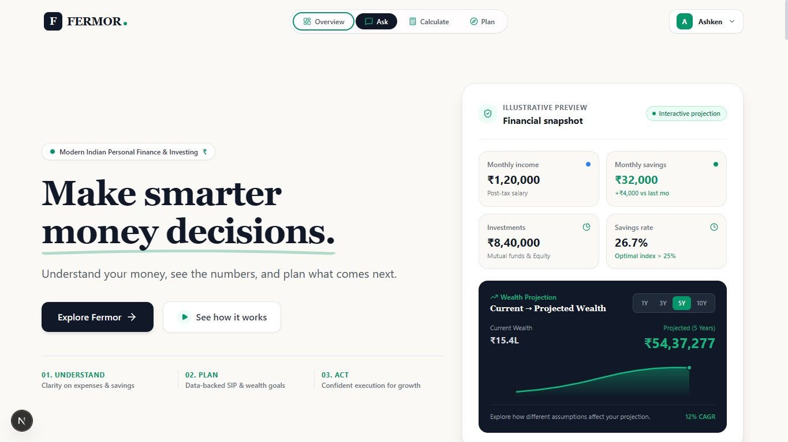
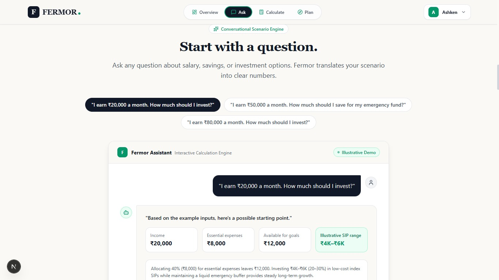
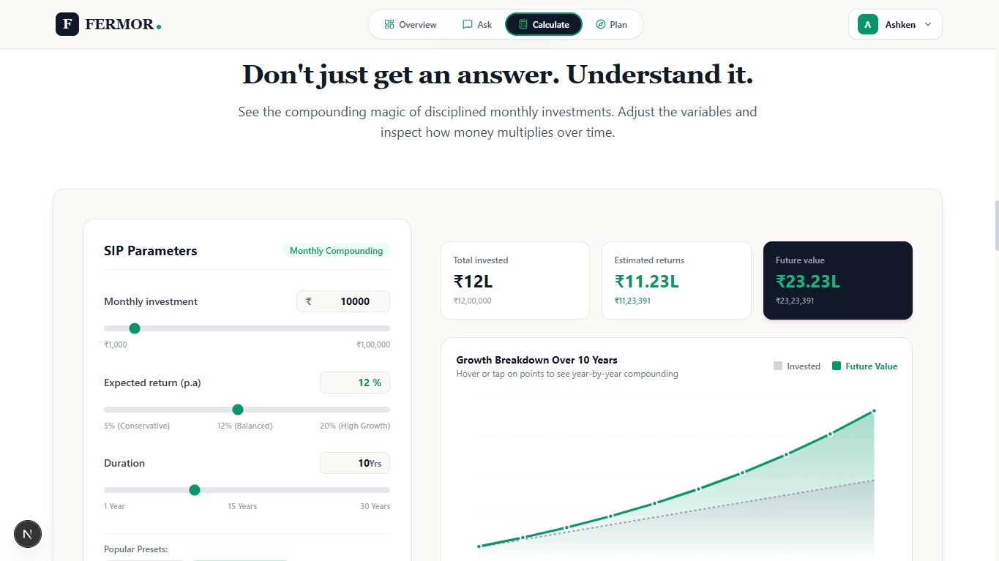
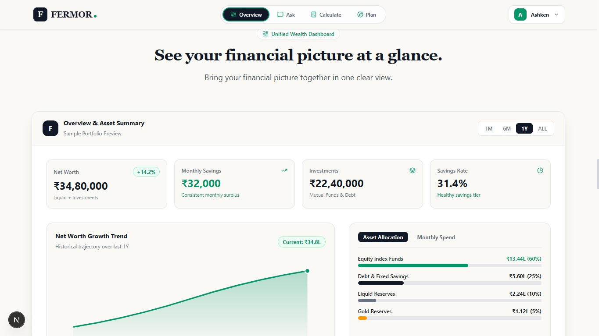
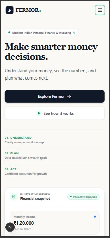

# FERMOR — Financial Decision Platform

A modern, responsive homepage concept for FERMOR, built as part of the FERMOR Frontend Developer Assignment.

## 🌐 Live Demo

[View Live Demo](https://fermor-assignment-9wigwj6ni-ashkens-projects.vercel.app/)

---

## 🎯 Project Overview

FERMOR helps users understand their money, explore financial scenarios, and plan their next financial decisions.

The homepage is designed around a simple journey:

**Understand → Plan → Act**

The core message of the experience is:

> Make smarter money decisions.

The design combines editorial typography with interactive financial product interfaces to create a clear and engaging fintech experience.

---

## 👥 Target Users

The homepage is primarily designed for young Indian professionals and first-time investors who want clearer answers to everyday financial questions.

Examples:

- How much should I invest?
- Can I afford a loan?
- How much should I save?
- Am I on track with my financial goals?

---

## ✨ Features

- Responsive fintech homepage
- Interactive financial snapshot
- Ask Fermor conversational interface
- Interactive SIP calculator
- Financial dashboard preview
- Future wealth projection
- Understand → Plan → Act navigation
- Demo authentication flow
- Smooth section navigation
- Interactive financial visualizations
- Responsive mobile navigation
- Accessible interactive controls
- Subtle UI animations and transitions

---

## 🛠️ Tech Stack

- Next.js
- React
- TypeScript
- Tailwind CSS
- CSS
- JavaScript

---

## 📸 Screenshots

### Hero Section



### Ask Fermor



### Financial Calculator



### Financial Dashboard



### Mobile Responsive



---

## 🚀 Getting Started

### Prerequisites

Make sure you have the following installed:

- Node.js
- npm

### Installation

Clone the repository:

```bash
git clone https://github.com/Ashken007/Fermor-Assignment.git
```

Navigate to the project directory:

```bash
cd Fermor-Assignment
```

Install dependencies:

```bash
npm install
```

Start the development server:

```bash
npm run dev
```

Open [http://localhost:3000](http://localhost:3000) in your browser.

---

## 🏗️ Production Build

Create a production build:

```bash
npm run build
```

Run the production server:

```bash
npm start
```

---

## 🧠 Design Approach

The homepage follows a three-step financial decision journey.

### 01 — Understand

Help users understand their current financial position through financial snapshots, spending insights and interactive questions.

### 02 — Plan

Allow users to explore financial scenarios using calculations, projections and planning tools.

### 03 — Act

Provide clear next steps once users understand their financial situation.

This structure keeps the experience focused on helping users make informed financial decisions rather than overwhelming them with financial terminology.

---

## 🎨 UI / UX Direction

The interface combines:

- Premium editorial typography
- Modern fintech product UI
- Data visualization
- Asymmetric layouts
- Subtle motion
- Interactive financial components
- Responsive design

The visual direction is intentionally calm, trustworthy and data-driven.

The design avoids excessive gradients, unnecessary animations and overly complex UI patterns.

---

## 📱 Responsive Design

The homepage is designed for:

- Desktop
- Laptop
- Tablet
- Mobile

The layout adapts across different screen sizes while maintaining readability, hierarchy and usability.

---

## 🔐 Authentication

The authentication experience is implemented as a frontend demo flow for this assignment.

The demo allows users to:

- Create an account
- Log in
- Continue to the dashboard preview
- Maintain demo authentication state
- Log out

No passwords or sensitive authentication information are stored.

---

## 📊 Financial Calculations

Financial calculations and projections shown in the interface are illustrative examples created to demonstrate the product experience.

Actual financial returns may vary.

---

## 📁 Project Structure

```text
src/
├── app/
│   ├── globals.css
│   ├── layout.tsx
│   └── page.tsx
│
├── components/
│   ├── Navbar
│   ├── Hero
│   ├── AskFermor
│   ├── SIPCalculator
│   ├── FinancialOverview
│   ├── FutureProjection
│   ├── ActionCards
│   ├── AuthModal
│   └── Footer
│
├── context/
└── utils/

public/
└── screenshots/
```

---

## 🧪 Testing

The interface has been designed and tested across:

- Desktop
- Laptop
- Tablet
- Mobile

Key interactions include:

- Navigation
- Authentication demo flow
- Financial calculator
- Financial projections
- Dashboard interactions
- Responsive navigation
- Interactive UI components

---

## 👨‍💻 Author

**Ashken R**

B.Tech Information Technology  
SRM Easwari Engineering College

---

## 📄 Assignment

This project was developed as part of the **FERMOR Frontend Developer Assignment**.

The implementation focuses on product thinking, visual quality, frontend engineering, responsiveness and attention to detail.